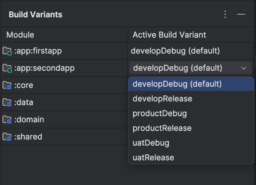
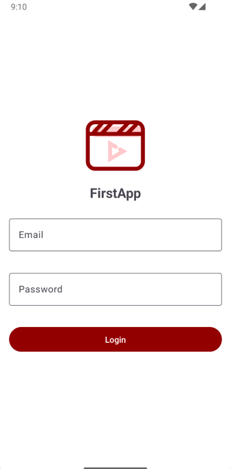
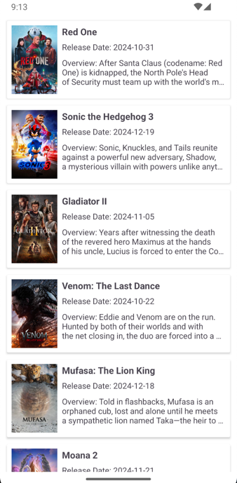
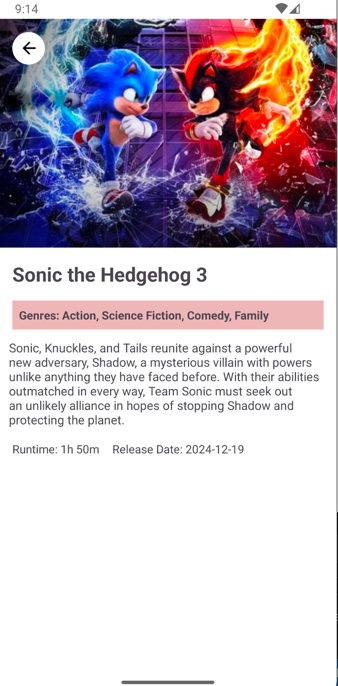
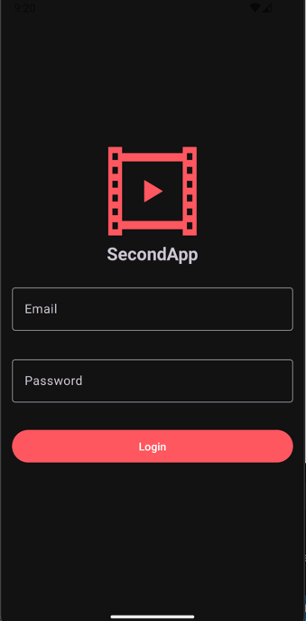
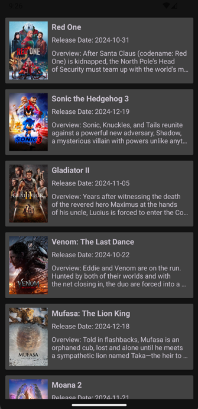
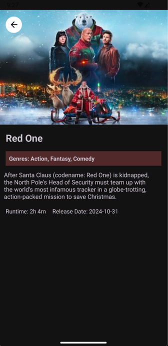
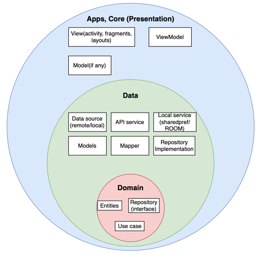
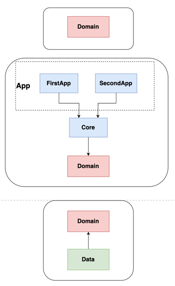
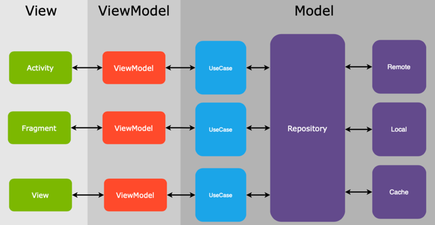

# Android Modules Clean Architecture [](https://app.codacy.com/gh/AliAsadi/Android-Clean-Architecture?utm_source=github.com&utm_medium=referral&utm_content=AliAsadi/Android-Clean-Architecture&utm_campaign=Badge_Grade_Settings)

2 Android Apps that use the same core logic, featuring Clean Architecture, Kotlin.

# Features

1. **Login**
2. **Movie List**
3. **Movie detail**
4. **Pagination**
5. **Pull to Refresh**

# Variants

Both apps have two variants: **develop**, **uat**, and **product**.


## The Motivation behind the app
This repository was created with the intention of sharing knowledge and using it to implement new challenges and ideas.

## Movies Mock Server API

**API:** [Movies Mock Server](https://movies-mock-server.vercel.app/)

This API is the primary data source for the app, providing a mock database of movie information. It is designed to mimic real-world data operations including fetching, updating, and managing movie data.

**API Repository:** [Movies Mock Server Repository](https://github.com/AliAsadi/movies-mock-server)

This repository hosts the source code and documentation for the Movies Mock Server API

# Screenshots

<p align="center">
  
  
  
</p>
<p align="center">
  
  
  
</p>

# Clean Architecture

The core principles of the clean approach can be summarized as followed:

#### 1. The application code is separated into layers.

These layers define the separation of concerns inside the code base.

#### 2. The layers follow a strict dependency rule.

Each layer can only interact with the layers below it.

#### 3. As we move toward the bottom layer — the code becomes generic.

The bottom layers dictate policies and rules, and the upper layers dictate implementation details such as the database, networking manager, and UI.

<p align="center">

</p>

<p align="center">

</p>

# Architecture Layers

The application consists of three layers:

The domain layer, the data layer, and the presentation layer.

# Structure
<p align="center">

</p>

## Built With 🛠
- [Kotlin](https://kotlinlang.org/) - First class and official programming language for Android development.
- [Coroutines](https://kotlinlang.org/docs/reference/coroutines-overview.html) - For asynchronous and more..
- [Android Architecture Components](https://developer.android.com/topic/libraries/architecture) - Collection of libraries that help you design robust, testable, and maintainable apps.
    - [Paging3](https://kotlinlang.org/) - Load and display small chunks of data at a time.
    - [ViewModel](https://developer.android.com/topic/libraries/architecture/viewmodel) - Stores UI-related data that isn't destroyed on UI changes.
    - [Navigation Components](https://developer.android.com/guide/navigation/navigation-getting-started) - Navigate fragments easier.

- [Dependency Injection](https://developer.android.com/training/dependency-injection)
    - [Hilt](https://dagger.dev/hilt) - Easier way to incorporate Dagger DI into Android application.
- [Retrofit](https://square.github.io/retrofit/) - A type-safe HTTP client for Android and Java.
- [Mockito](https://github.com/mockito/mockito) - For Mocking and Unit Testing

## 💎 Code Style

The code style in this project was ensured using [Detekt](https://detekt.dev/).

**Check command:**

```
./gradlew detekt
```

## 🔮 Improvement
- Implement Unit-test & test coverage report
- Handle Error
- Add more screen feature
- Local CI with githooks: ktlint, detekt

## License
```
   Copyright (C) 2020 Ali Asadi
   Licensed under the Apache License, Version 2.0 (the "License");
   you may not use this file except in compliance with the License.
   You may obtain a copy of the License at

       http://www.apache.org/licenses/LICENSE-2.0

   Unless required by applicable law or agreed to in writing, software
   distributed under the License is distributed on an "AS IS" BASIS,
   WITHOUT WARRANTIES OR CONDITIONS OF ANY KIND, either express or implied.
   See the License for the specific language governing permissions and
   limitations under the License.
```

## Contributing
Just make pull request. You are in!
